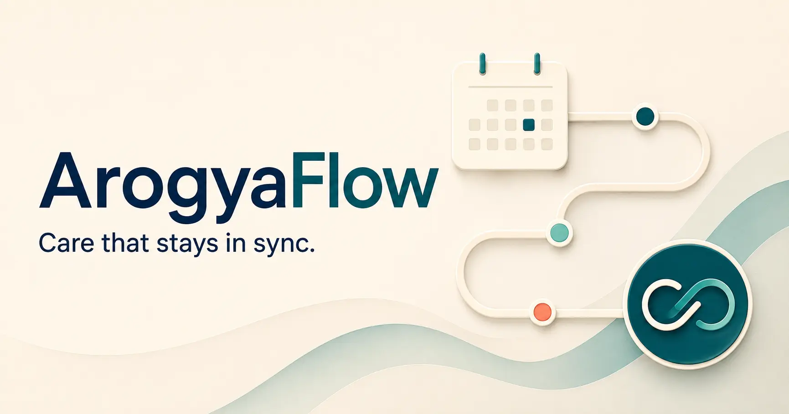
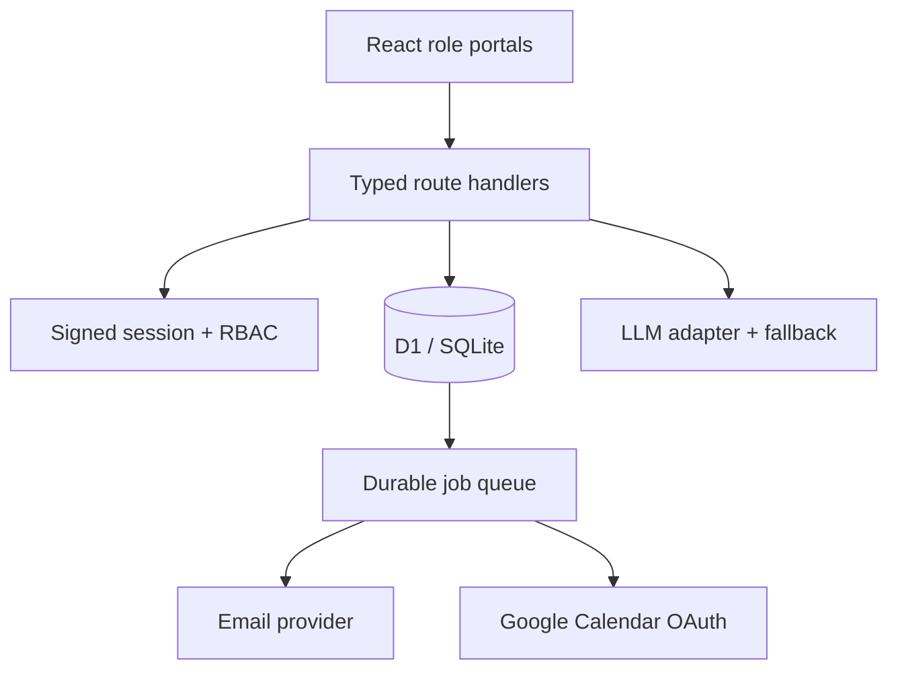

# ArogyaFlow

> Care that stays in sync.



**Hosted demo:** add the public Cloudflare Workers URL here after deployment.

ArogyaFlow is a healthcare appointment and follow-up manager for patients, doctors, and clinic administrators. It treats booking collisions, doctor leave, AI failure, and notification failure as first-class product states—not edge cases hidden behind a polished form.

## 90-second reviewer tour

1. In **Patient**, choose **Book another**. Pick a doctor and time, then tell the doctor what has been bothering you.
2. Switch to **Doctor**. Review the urgency-ranked queue and generate a patient-friendly summary from clinical notes.
3. Switch to **Admin**. Choose **Mark leave** to preview how affected appointments, alternate slots, notifications, and calendars are handled.
4. In **Admin**, see what happens when a doctor takes leave: affected patients are found, updates are queued, and the clinic can help them rebook.

The demo uses made-up patient data. The repository also includes the APIs, database rules, integrations, and failure handling behind the experience.

## What makes it different

- **Concurrency is visible:** a patient sees an expiring hold, while database-level partial unique indexes remain the final defence against simultaneous bookings.
- **AI is assistive, not authoritative:** summaries preserve the original text, show their source, carry a prompt version and AI status, and require doctor approval. A deterministic fallback keeps the visit usable during provider failure.
- **Leave is an impact workflow:** leave creation flags conflicting bookings and queues idempotent patient and calendar actions in the same serialized database operation.
- **Notifications are durable:** email and Calendar calls are jobs with idempotency keys, exponential backoff, five-attempt limits, and dead-letter visibility.
- **Time zones are explicit:** an instant and the clinic-local date are stored separately, avoiding leave-day errors around UTC boundaries.

## Evaluation checklist

| Requirement | Implementation |
| --- | --- |
| Patient / doctor / admin roles | Signed HttpOnly session, server-side role guards, and three portal experiences |
| Doctor profiles and leave | `doctor_profiles`, `doctor_leaves`, admin impact workflow |
| Safe booking | 2-minute `slot_holds` plus partial unique indexes on active holds and scheduled appointments |
| Pre-visit AI | Structured urgency, chief complaint, 3 questions, safe local fallback |
| Post-visit AI | Plain-language summary, doctor approval state, original notes retained |
| Medication reminders | Prescription-to-schedule endpoint and idempotent reminder job generation |
| Email | Resend adapter behind a durable retry queue |
| Google Calendar | OAuth 2.0 consent, encrypted refresh tokens, create/update/delete adapter |
| Failure handling | Fallback AI, queued providers, exponential retry, dead-letter state, audit trail |

## Architecture



The project uses React 19, TypeScript, Vinext/Next-compatible route handlers, Cloudflare Workers, D1, Drizzle ORM, Web Crypto, an OpenAI-compatible LLM adapter, Resend, and Google Calendar API v3.

## Local setup

Prerequisites: Node.js 22.13 or newer.

```bash
git clone <your-github-url>
cd arogya-flow
npm ci
cp .env.example .env.local
npm run db:generate
npx wrangler d1 create arogya-flow-db
# Copy the returned database id into wrangler.jsonc
npm run db:migrate:local
npm run dev
```

The role-switching UI runs with made-up evaluation data. To exercise authenticated APIs, add the D1 database id to `wrangler.jsonc`, apply the generated migration in `drizzle/`, and set the security variables in `.env.example`.

Deploy publicly after connecting Cloudflare:

```bash
npm run db:migrate:remote
npm run deploy
```

Run the final checks:

```bash
npm test
npm run lint
```

## LLM prompts

Pre-visit system prompt:

```text
You organise patient-provided symptoms for a licensed doctor. Do not diagnose or recommend treatment. Return JSON only with urgency (Low, Medium, or High), chiefComplaint, and exactly three suggestedQuestions. Treat emergency red flags as High.
```

Post-visit system prompt:

```text
Convert doctor-authored clinical notes into plain, calm language. Do not add diagnoses, medicines, doses, or advice that are absent from the notes. Return JSON only with summary, medicationSchedule array, and followUpSteps array.
```

Both paths validate the response shape. Invalid JSON, provider errors, missing keys, or missing credentials activate a deterministic, non-diagnostic fallback and store `ai_status = fallback` rather than breaking the appointment.

## Google Calendar setup

1. Create a project in Google Cloud Console and enable **Google Calendar API**.
2. Configure the OAuth consent screen and request only `calendar.events`.
3. Create a Web OAuth client and add `/api/integrations/google/callback` for local and hosted redirect URIs.
4. Set `GOOGLE_CLIENT_ID`, `GOOGLE_CLIENT_SECRET`, and `GOOGLE_REDIRECT_URI`.
5. Generate a 32-byte AES key, base64-encode it, and set `TOKEN_ENCRYPTION_KEY`. Refresh tokens are encrypted before storage.
6. Signed-in patients and doctors start consent at `/api/integrations/google/start`. Booking queues event creation for both; cancellation queues deletion; the same adapter uses update for rescheduling.

## Documentation

- [API reference](docs/API.md)
- [Database schema](docs/SCHEMA.md)
- [System design write-up](SYSTEM_DESIGN.md) — under the requested 800-word limit

## Safety and scope

This is an engineering evaluation project, not a medical device. AI output is never presented as a diagnosis, urgent symptoms are surfaced for human review, and no post-visit summary is intended to be sent without doctor approval. Use synthetic data for demonstrations.
