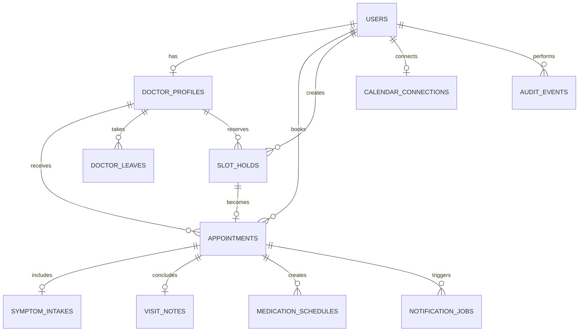

# Database schema

The schema is defined in `db/schema.ts`; the generated SQL migration is committed in `drizzle/`. Foreign keys preserve ownership, while partial unique indexes enforce availability only for active holds and scheduled appointments.

## Important invariants

- `active_doctor_slot_hold_unique`: one active hold per doctor and start instant.
- `doctor_appointment_slot_unique`: one scheduled appointment per doctor and start instant.
- `doctor_leave_date_unique`: no duplicate leave records.
- `notification_jobs.idempotency_key`: provider retries cannot create duplicate logical messages.
- `symptom_intakes.appointment_id` and `visit_notes.appointment_id`: one canonical intake and note record per appointment.
- `appointments.local_date`: clinic-local day is stored separately from UTC timestamps for leave matching.

## Sensitive data

Passwords are stored only as salted PBKDF2 hashes. Google refresh tokens are AES-256-GCM ciphertext. Provider secrets stay in environment variables. `audit_events` stores action metadata, not symptom or clinical-note bodies.
